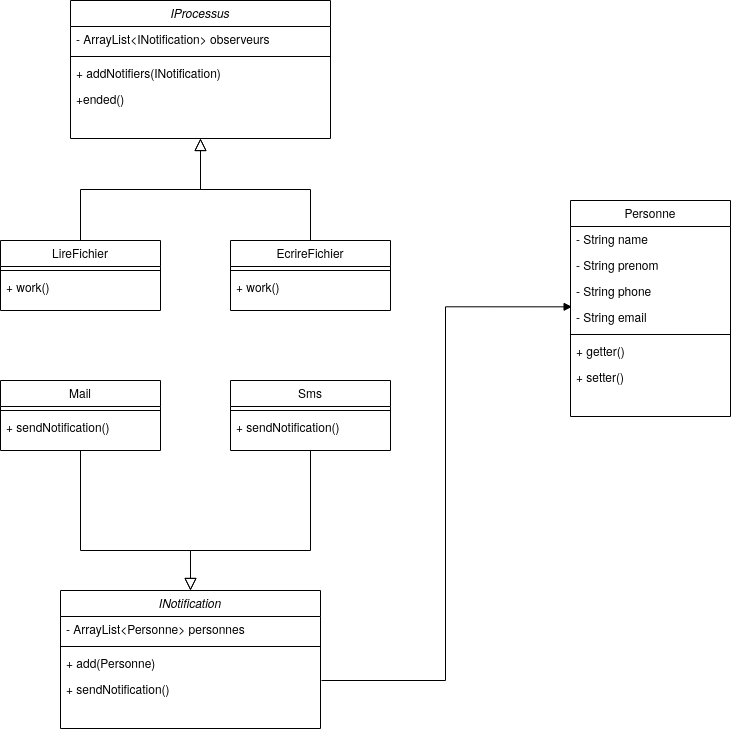

# Exercice Composite

On souhaite réaliser une application qui envoie des mails et/ou des sms à un groupe de personne lorsque la lecture et l'écriture d'un fichier est réalisé.
Pour y parvenir nous allons mettre le pattern Observateur afin de notifier la fin des traitements. Voici le diagramme UML de l'application que nous souhaitons réaliser :

